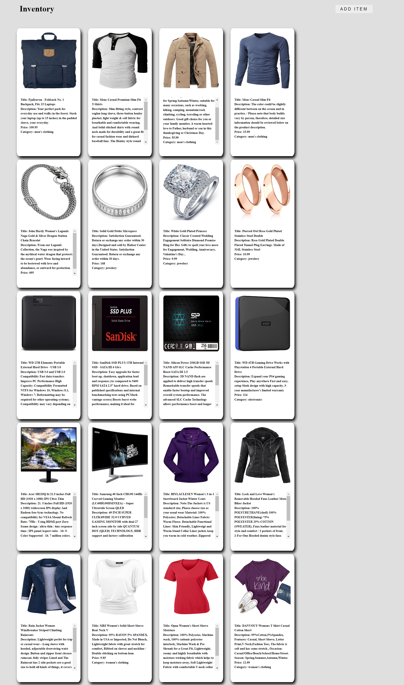
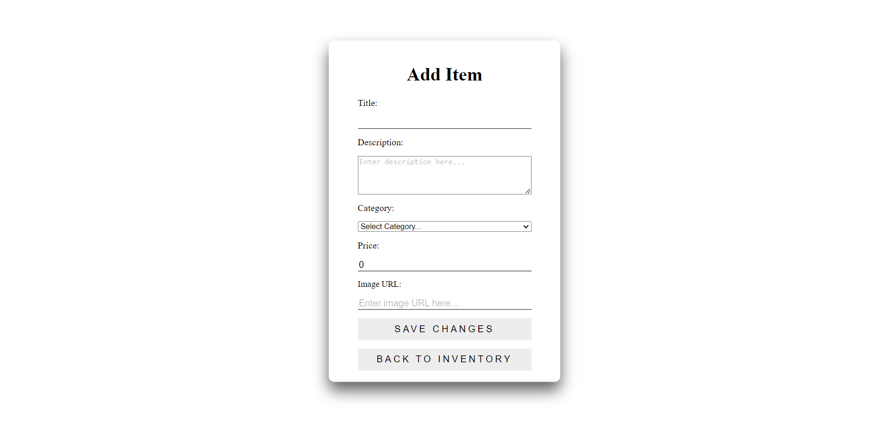

**Project Overview**
**Purpose:**
The Inventory App is a robust application designed to manage and track inventory items efficiently. The app provides a user-friendly interface for displaying items, along with functionalities to update, delete, and manage inventory details. It leverages a custom backend API to handle data operations, ensuring seamless interaction between the frontend and backend systems.

**STAR Questions**
**Situation:**
The Inventory App was developed to address the need for a streamlined and efficient way to manage inventory items. Businesses often struggle with keeping track of their inventory, and this app aims to simplify the process by providing a comprehensive solution that is both intuitive and powerful.

**Task:**
The primary task was to create a system that allows users to view, update, and delete inventory items easily. This involved designing a clean and responsive user interface for the frontend and developing a custom backend API to handle data operations. The goal was to ensure smooth communication between the frontend and backend, providing real-time updates and accurate inventory management.

**Action:**
The Inventory App was developed collaboratively with my apprentice cohort and hosted on a Multiverse GitHub repository. We maintained a clear separation between frontend and backend functionalities. The frontend was built using React.js, creating an interactive and responsive UI. The backend was implemented with Node.js and Express.js, featuring custom API functions for data handling.

**Result:**
The app successfully delivers a robust inventory management solution with a clean UI and responsive design. Users can easily view, update, and delete inventory items, ensuring efficient inventory management. The custom backend API provides reliable data handling and real-time updates, enhancing the overall user experience. The app's flexibility and comprehensive features make it a valuable tool for businesses of all sizes.

**Technologies Used**
Frontend: React.js, CSS, JavaScript
Backend: Node.js, Express.js
API Integration: Custom backend API for data operations
Other: RESTful API design

**Job Function Competencies**

**Job Function 2.4: Demonstrates commitment to continued professional development**
Throughout the development of the Inventory App, I demonstrated a strong commitment to continuous professional development. Building this project collaboratively allowed me to enhance and refine my skills in web development and backend integration. I invested time in mastering custom API development and ensuring seamless communication between the frontend and backend, which involved persistent learning and experimentation.

**Job Function 3.3: Understands how to develop effective user interfaces**
In developing the user interface (UI) for the Inventory App, I prioritized creating an intuitive and visually appealing experience for users. Leveraging React.js, I designed a clean and responsive UI that effectively supports inventory management tasks. The UI includes functionalities for viewing, updating, and deleting inventory items, ensuring a seamless and enjoyable user experience.

**Job Function 3.5: Understands how to follow software designs and functional/technical specifications**
The development of the Inventory App adhered to clear software design and functional/technical specifications. The project began with a detailed outline of features, including custom API development, user input forms, and real-time data updates. Each feature was meticulously planned and implemented to meet these specifications, ensuring a cohesive and functional application.

**Job Function 4.7: Understands how to apply algorithms, logic, and data structures**
While the Inventory App primarily focused on frontend development using React.js, understanding algorithms, logic, and data structures was crucial for implementing efficient solutions. This included managing user sessions, handling form submissions, and integrating real-time data with Node.js and Express.js. By applying logical structures and algorithms, the application operates smoothly and meets user expectations.

